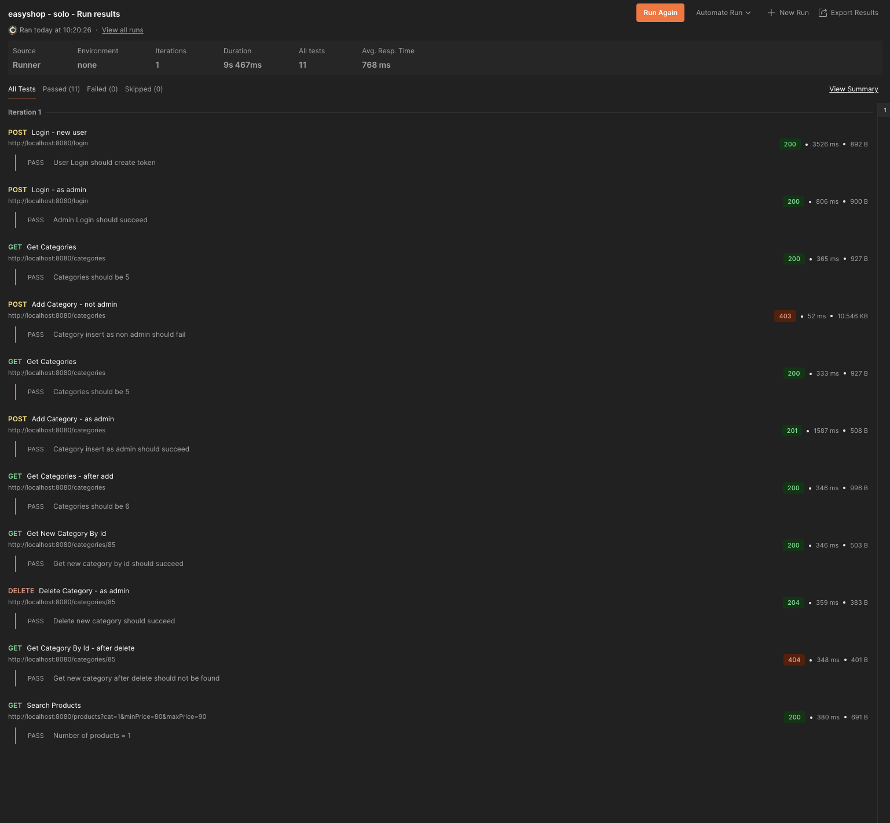

# 🛍️ EasyShop – Backend

## Overview

**EasyShop** is a Java-based Spring Boot backend for a full-featured e-commerce platform. It supports user registration and login, shopping cart management, order checkout, product browsing, and admin-level product control. The backend connects to a SQL Server database and follows a layered architecture using DAO classes and models.

This capstone project demonstrates:

- RESTful API development
- Role-based access control (with Spring Security)
- Secure authentication using JWT tokens
- SQL Server database integration using JDBC
- Structured controller-service-dao architecture

---

## ✅ Key Features

- User registration and login
- Secure JWT authentication
- Admin-only product creation, update, and deletion
- Product browsing for all users
- Add to cart, update quantity, remove from cart
- Checkout flow (creates order and order line items)
- View and update user profile

---

## 📸 Screenshots

Below are two screenshots from Postman:

### ✅ Required Endpoints Test Run


### 🔄 Optional Features Test Run


---

## 💡 Interesting Code Snippet

This method inside the `OrdersController` class implements the checkout logic. It validates the user, reads from their shopping cart, creates a new order, saves each item as an order line item, and clears the cart. This illustrates exception handling, user lookup, and DAO-layer interaction all in one cohesive method:

```java
@PostMapping
public Order checkout(Principal principal) {
    String userName = principal.getName();
    User user = userDao.getByUserName(userName);

    if (user == null) {
        throw new ResponseStatusException(HttpStatus.NOT_FOUND, "User not found.");
    }

    int userId = user.getId();
    var cart = shoppingCartDao.getByUserId(userId);

    if (cart == null || cart.getItems().isEmpty()) {
        throw new ResponseStatusException(HttpStatus.BAD_REQUEST, "Shopping cart is empty.");
    }

    Order order = new Order();
    order.setUserId(userId);
    order.setDate(LocalDate.now());
    order.setAddress("123 Main St");
    order.setCity("Sample City");
    order.setState("CA");
    order.setZip("12345");
    order.setShippingAmount(new BigDecimal("5.99"));

    Order createdOrder = orderDao.create(order);
    int orderId = createdOrder.getOrderId();

    List<OrderLineItem> orderLineItems = new ArrayList<>();

    for (ShoppingCartItem item : cart.getItems().values()) {
        OrderLineItem lineItem = new OrderLineItem();
        lineItem.setOrderId(orderId);
        lineItem.setProductId(item.getProduct().getProductId());
        lineItem.setSalesPrice(item.getProduct().getPrice());
        lineItem.setQuantity(item.getQuantity());
        lineItem.setDiscount(BigDecimal.ZERO);

        orderLineItemDao.create(lineItem);
        orderLineItems.add(lineItem);
    }

    shoppingCartDao.clearCart(userId);

    createdOrder.setLineItems(orderLineItems); 
    return createdOrder;

}
```

